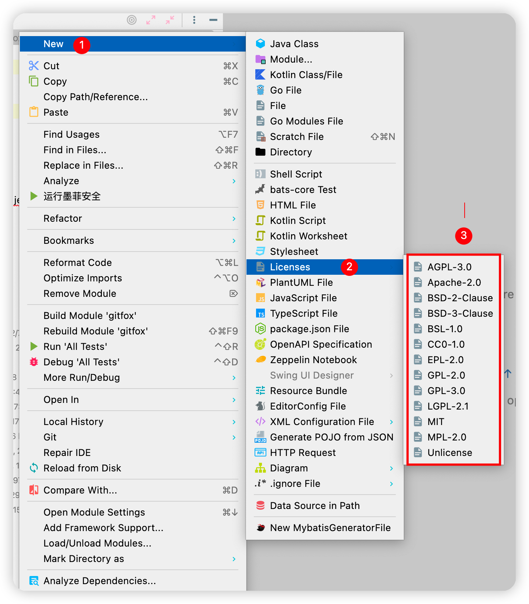
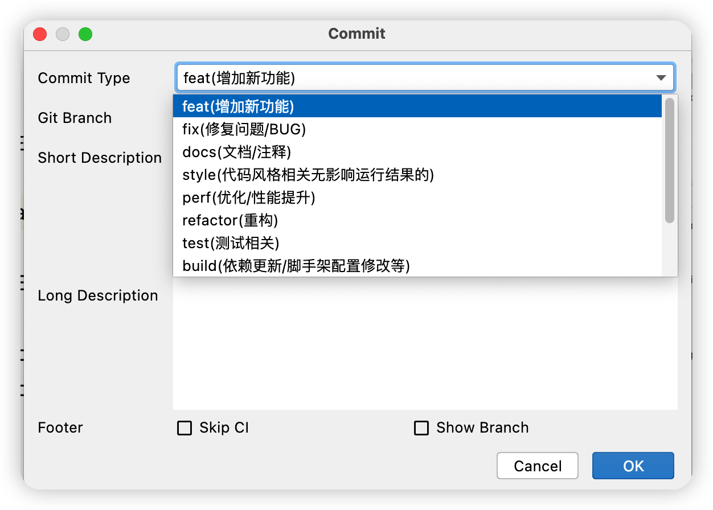
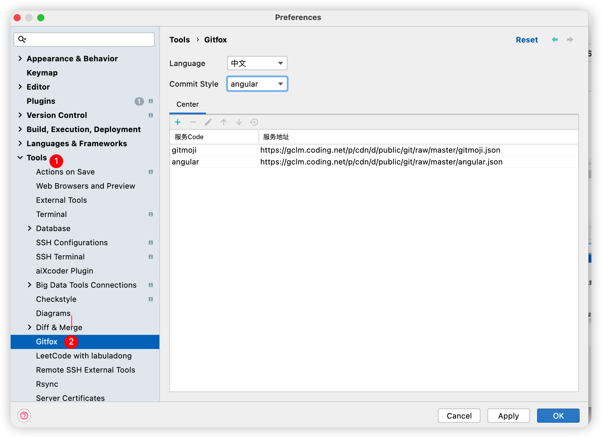
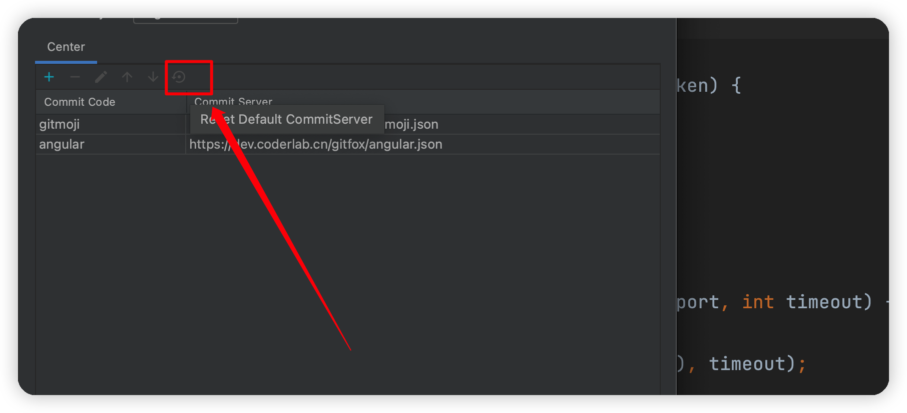

# gitfox


[](https://plugins.jetbrains.com/plugin/19448-gitfox)
[](https://plugins.jetbrains.com/plugin/19448-gitfox)

## Introduction | 简介

<!-- Plugin description -->

Gitfox is a super fox living in the git world. He has the following skills: gitcommit commit specification, open source
protocol generation.

**中文:**

Gitfox一只生活在git世界的超级狐，他具有以下技能: gitcommit提交规范、开源协议生成。

## Installation | 安装

- Using IDE built-in plugin system:

  <kbd>Settings/Preferences</kbd> > <kbd>Plugins</kbd> > <kbd>Marketplace</kbd> > <kbd>Search for "gitfox"</kbd> >
  <kbd>Install Plugin</kbd>

---
<!-- Plugin description end -->

## 效果演示






## 自定义效验规则

- 数据结构

```
{
  "code": "feat",
  "description_en": "A new feature",
  "description": "增加新功能"
},
```

- 实例 [Angular](docs/specification/angular.json)
